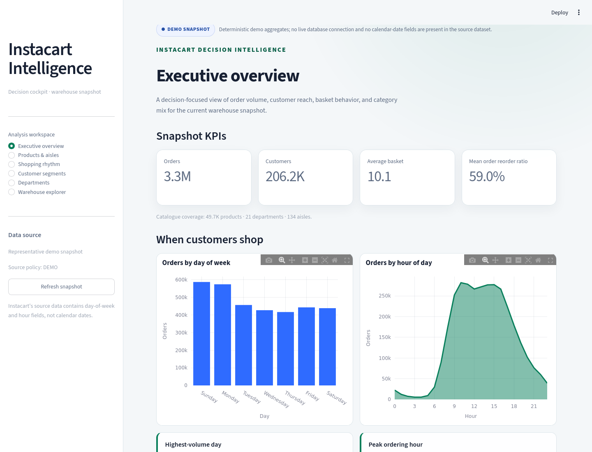
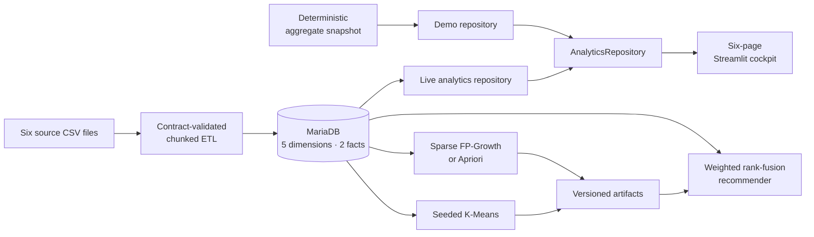

# Instacart Decision Intelligence

[](https://github.com/nvtank/nvtank-InstacartDataWareHouse/actions/workflows/ci.yml)
[](pyproject.toml)
[](compose.yaml)
[](LICENSE)

An end-to-end batch analytics platform that turns the public Instacart market-basket
dataset into a partitioned MariaDB warehouse, a six-page Streamlit decision cockpit, and
reproducible clustering, association-rule, and recommendation artifacts.



## Why this project stands out

- **Data engineering:** typed configuration, source contracts, pure transforms, chunked
  fact loading, duplicate-load protection, derived metrics, and machine-readable run
  reports.
- **Warehouse design:** five dimensions, two explicit fact grains, 15 fact partitions,
  analytical indexes, and ETL-enforced integrity where partitioned MariaDB facts cannot
  use the desired foreign keys.
- **Analytics product:** one repository contract powers deterministic demo, fail-closed
  live, and health-checked auto-fallback modes across six decision-focused pages.
- **Applied ML:** seeded K-Means, bounded silhouette evaluation, sparse FP-Growth/Apriori,
  exact JSON itemsets, and weighted reciprocal-rank fusion.
- **Operability:** non-root container, Compose profiles, health checks, idempotent schema
  setup, one-command fixture integration test, and Python 3.11/3.13 CI.

## Run the portfolio demo

The demo needs Docker with Compose. It does not need MariaDB or the source CSV files.

```bash
make demo-detached
```

Open <http://localhost:8501>, then stop it with:

```bash
make down
```

For a local Python process:

```bash
make install
DASHBOARD_MODE=demo ./run_dashboard.sh
```

The source badge always identifies whether the UI is using a live warehouse or the
representative demo snapshot.

## Verified engineering evidence

The following gates were run locally on 2026-08-09 against this branch:

| Gate | Result |
| --- | --- |
| Complete offline suite | 104 tests passed with `FutureWarning` treated as error |
| ETL contract suite | 51 tests; 97.52% targeted coverage |
| Dashboard suite | 28 tests; 82.73% targeted coverage; all six pages navigated |
| Mining and recommendation suite | 25 deterministic tests |
| MariaDB fixture integration | Schema + ETL + validation passed; seven tables reconciled |
| Container runtime | Streamlit health endpoint returned `ok`; process UID was `10001` |
| Static and configuration checks | Ruff, shell syntax, Compose config, and diff checks passed |

Reproduce the two main local gates:

```bash
make qa
make smoke-fixture
```

`make smoke-fixture` creates an isolated Compose project, reapplies the idempotent SQL
workflow, loads six small CSV fixtures through the packaged ETL command, verifies the
warehouse contracts and exact row counts, then removes only its dedicated test volume.

## Architecture



The source contains day-of-week and hour-of-day fields, not calendar dates. This is a
historical batch warehouse, so the dashboard presents recurring shopping patterns rather
than real-time or dated trends.

### Warehouse model

| Table | Grain | Physical design |
| --- | --- | --- |
| `Dim_Time` | One recurring day/hour bucket | 168 deterministic rows |
| `Dim_Department` | One source department | Unique business key and name |
| `Dim_Aisle` | One source aisle | Unique business key and name |
| `Dim_Product` | One source product | Department and aisle foreign keys |
| `Dim_User` | One derived customer profile | Rule-based behavioral segment |
| `Fact_Orders` | One prior/train order | Seven LIST partitions by day of week |
| `Fact_Order_Details` | One order-product occurrence | Eight RANGE partitions by order ID |

Important semantic contracts include:

- first-order `days_since_prior_order` remains `NULL`; zero is a valid interval;
- detail `time_id` starts `NULL` and must be fully reconciled before a load passes;
- only `prior` and `train` orders enter the facts because public `test` orders have no
  matching order-product input;
- a normal ETL run refuses a populated target, while reset requires both `--reset-data`
  and `--yes`.

See the [architecture](docs/architecture.md) and
[data dictionary](docs/data-dictionary.md) for component boundaries, table grains,
partitioning, NULL semantics, and design tradeoffs.

## Dashboard workspaces

| Workspace | Decision support |
| --- | --- |
| Executive overview | Order reach, customer reach, basket behavior, and category mix |
| Products & aisles | Product ranking, exact department filtering, search, and reorder context |
| Shopping rhythm | Day/hour distributions and normalized weekend-vs-weekday behavior |
| Customer segments | Rule-based segment contribution and basket-size bands |
| Departments | Volume, reorder context, and normalized two-department comparison |
| Warehouse explorer | Whitelisted schema, index, partition, storage, and lazy sample inspection |

The UI uses bound query parameters, a fixed table whitelist, credential-free cache keys,
sanitized infrastructure errors, CSV downloads, and visible data provenance. The ETL
segments (`New`, `Regular`, `Frequent`, `VIP`) are intentionally separate from offline
K-Means cluster labels.

See the [dashboard guide](dashboard/README.md) for source-mode and page contracts.

## Load the live warehouse

Download the Instacart Market Basket Analysis files separately and place these six files
under `./data`:

```text
aisles.csv
departments.csv
products.csv
orders.csv
order_products__prior.csv
order_products__train.csv
```

Then configure local-only credentials and run the load:

```bash
cp .env.example .env
# Edit .env before continuing.
make etl
make live-detached
```

Useful ETL controls:

```bash
instacart-etl --dry-run
instacart-etl --validate-only
instacart-etl --reset-data --yes
```

Every completed CLI attempt writes a JSON report with run ID, configuration summary,
stage counts, timings, quality results, and typed success or failure status.

## Reproducible mining

Mining is bounded by default and runs only against a loaded warehouse:

```bash
# Select K by bounded silhouette score and persist model/scaler metadata.
instacart-cluster --max-k 10 --silhouette-sample-size 10000 --no-plots

# Mine a deterministic sample of complete baskets.
instacart-basket --order-limit 100000 --top-products 2000 --no-plot

# Fuse exact-set rule ranking with same-cluster product popularity.
instacart-recommend --user-id 1 --cart "Banana" "Whole Milk" --top-n 10
```

Full basket mining requires the explicit `--full` flag. Generated CSV, JSON, joblib, and
plot artifacts are written under `mining/results/` and excluded from Git. See the
[mining guide](mining/README.md) for artifact schemas and limitations.

## Project layout

```text
.
├── analysis/            # Business SQL queries
├── dashboard/           # Repository contract, demo/live sources, and six UI pages
├── docs/                # Architecture, data dictionary, screenshot, and CV brief
├── etl/                 # Configuration, contracts, transforms, loaders, and pipeline
├── mining/              # Clustering, basket mining, artifacts, and recommendation
├── scripts/             # Isolated fixture integration workflow
├── sql/                 # Safe schema, partitions, indexes, maintenance, and checks
├── tests/               # 104 offline tests plus deterministic CSV fixtures
├── compose.yaml         # Demo, live, and tool profiles
├── Dockerfile           # Cache-friendly non-root application image
└── Makefile             # Install, QA, demo, live, ETL, smoke, and teardown workflows
```

## Portfolio and contribution notes

- [Portfolio brief](docs/portfolio.md): copy-ready CV bullets, interview talking points,
  verified evidence, and a full-scale benchmark acceptance gate.
- [Contributing guide](CONTRIBUTING.md): development workflow and correctness contracts.
- [MIT license](LICENSE).

### Evidence boundary

The deterministic demo represents 3,346,083 prior/train orders, 33,819,106 order items,
206,209 users, and 49,688 products as an internally reconciled presentation contract. It
does **not** claim that this checkout completed and benchmarked a fresh full-corpus load.
Until a recorded full-scale report exists, this project does not claim ETL throughput,
warehouse size, partition speedup, model quality, recommendation precision, or business
uplift.

That boundary keeps the CV story strong and defensible: the architecture, correctness
controls, test suite, container runtime, and fixture integration are verified; full-scale
performance remains a named future evidence gate.
