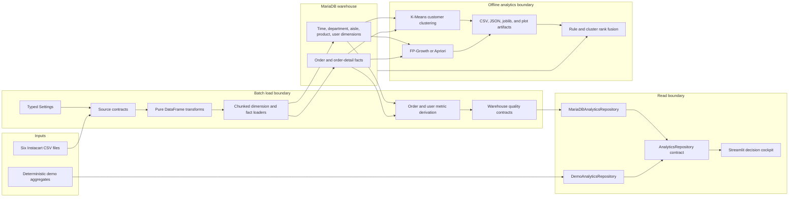

# Architecture

## Purpose and scope

Instacart Decision Intelligence is a batch analytics project with three distinct
delivery paths:

1. a validated CSV-to-MariaDB warehouse load;
2. a Streamlit decision cockpit backed by either the warehouse or deterministic
   representative aggregates; and
3. offline mining jobs that produce versioned local artifacts for clustering,
   association rules, and hybrid recommendations.

The source dataset contains day-of-week and hour-of-day fields. It does not
contain calendar dates or an event stream, so the system is a warehouse snapshot,
not a real-time platform.

## System context and data flow

Arrows describe dependencies, not independent queues. ETL and mining are
synchronous command-line jobs, while Streamlit executes read-only aggregate
queries on demand and caches repository results.

## Component boundaries

| Boundary | Responsibility | Explicitly does not own |
| --- | --- | --- |
| `etl/config.py` | Parse typed environment settings, construct a credential-safe SQLAlchemy URL, and expose shared paths and limits | Dataset transformation or UI state |
| `sql/` | Create the database, tables, checks, partitions, and indexes | Loading CSV rows or deriving behavioral metrics |
| `etl/quality.py` | Enforce source-frame and post-load warehouse contracts | Repair invalid source data |
| `etl/transforms.py` | Convert validated source frames into warehouse-shaped frames | Database connections or transaction control |
| `etl/load_dimensions.py` and `etl/load_facts.py` | Stream CSV chunks and control load transactions | Dashboard aggregates or mining models |
| `etl/update_fact_metrics.py` | Reconcile order totals and derive rule-based user attributes | K-Means labels |
| `etl/etl_pipeline.py` | Orchestrate preconditions, stages, failure reporting, and final checks | Schema creation |
| `dashboard/data.py` | Define the stable analytics repository and implement live/demo sources | Rendering or navigation |
| `dashboard/pages/` | Render business views through `AnalyticsRepository` | SQLAlchemy engines or raw SQL |
| `mining/` | Run reproducible offline experiments and serialize artifacts | Mutating canonical warehouse segmentation |
| Docker Compose and `Makefile` | Package demo, database, ETL, and live workflows | Supplying the separately downloaded source dataset |

This separation keeps UI code independent of SQL and prevents deterministic
demo fixtures from leaking into live warehouse code paths.

## Warehouse load lifecycle

The `instacart-etl` entry point performs the following ordered workflow:

1. Validate configuration and require all seven warehouse tables.
2. Require all six source files before beginning a load.
3. Refuse to append when ETL-owned tables already contain rows. A destructive
   reload requires both `--reset-data` and `--yes`.
4. Validate, transform, and load department, aisle, and product dimensions in
   one dimension transaction.
5. Stream `orders.csv` in bounded chunks, retaining only `prior` and `train`
   orders for `Fact_Orders`.
6. Stream the prior and train order-product files into
   `Fact_Order_Details`. Detail `time_id` values begin as `NULL` and are then
   reconciled from the parent order one partition at a time.
7. Derive `Fact_Orders.total_items`, `Fact_Orders.reorder_ratio`, and the
   behavioral fields in `Dim_User`.
8. Execute all warehouse contracts and write a JSON execution report, including
   stage counts and either a success result or a typed failure.

Dimensions are all-or-nothing within their shared transaction. Fact loading uses
bounded chunk transactions, so a process failure may leave committed fact chunks.
The empty-target guard prevents an accidental retry from silently duplicating
those rows; recovery is an explicit reset-and-reload operation.

## Dashboard source modes

`DASHBOARD_MODE` controls repository selection.

| Mode | Behavior | Failure policy |
| --- | --- | --- |
| `demo` | Reads deterministic representative aggregate fixtures and table samples; no database connection is opened | Fails only if the fixture/schema contract is internally unavailable |
| `live` | Connects to MariaDB and runs read-only aggregate queries | Fails closed if live readiness does not pass |
| `auto` | Attempts the same live readiness check first | Falls back to demo with a sanitized reason |

Live readiness checks connection availability, the complete seven-table schema,
the `Dim_User.user_segment` column, and the presence of order, order-detail, and
user rows. A source badge identifies live warehouse versus demo snapshot in the
UI. The demo is representative and reproducible; it is not claimed to be a
row-for-row copy of a particular live load.

All pages depend on `AnalyticsRepository`. Repository calls are cached by source
metadata, method, and parameters. The warehouse explorer additionally validates
table names against a fixed whitelist and loads metadata for only the selected
table; a sample query requires explicit user action.

## Offline analytics flow

Mining reads the reconciled warehouse but remains outside the dashboard's
canonical segment definition.

- Customer clustering standardizes four warehouse-derived features, selects or
  accepts a K, trains K-Means with a fixed random state, and records metrics and
  model artifacts.
- Market-basket analysis defaults to a deterministic bounded order sample. Full
  data processing requires an explicit flag. Itemsets use JSON arrays rather
  than ambiguous comma-delimited strings.
- Recommendations apply rules only when the full antecedent is contained in the
  cart, derive cluster-popular products through a connection-local temporary
  table, and combine rankings with weighted reciprocal-rank fusion.

The dashboard's `New`, `Regular`, `Frequent`, and `VIP` labels are deterministic
ETL rules. They are not K-Means outputs. Cluster labels live in mining artifacts
and are consumed explicitly by the recommendation CLI.

## Runtime topology

The container image installs project dependencies during image build and runs as
a non-root user. Startup does not install packages. Compose separates three
profiles:

- `demo` runs only the deterministic dashboard;
- `live` runs MariaDB and the fail-closed live dashboard after the database
  healthcheck passes; and
- `tools` exposes the packaged `instacart-etl` command with `./data` mounted
  read-only.

MariaDB persists in a named volume. `make down` preserves that volume. Passwords
are supplied through environment configuration, and the schema helper does not
place password values in client command arguments.

`make smoke-fixture` uses a separate Compose project and dedicated volume. It
applies the schema twice to prove the normal SQL path is idempotent, loads six
small CSV fixtures through the packaged ETL, checks the warehouse contracts and
exact table counts, and then removes only that isolated volume. This is an
integration contract, not evidence of full-corpus throughput.

## Trust and failure boundaries

- Source validation rejects missing columns, empty inputs, invalid ranges,
  invalid enumerations, blank names, and duplicate business grains before load.
- Fact-table relationships are checked during reconciliation because MariaDB
  partitioned tables do not carry the same foreign keys as `Dim_Product`.
- The dashboard logs server-side failures while presenting sanitized messages;
  connection strings and credentials are not rendered.
- Live mode distinguishes a reachable database from a usable warehouse by
  checking schema and minimum data, not only `SELECT 1`.
- Mining artifacts include schema versions, timestamps, parameters, counts, and
  random-state metadata so results can be interpreted without guessing how a
  run was configured.

## Design tradeoffs

| Decision | Benefit | Cost or limit |
| --- | --- | --- |
| Day/hour `Dim_Time` rather than calendar dates | Exactly represents the available source and supports weekly/hourly analysis | Cannot support calendar trends, freshness windows, seasons, or real-time claims |
| Partition facts by `order_dow` and `order_id` | Makes partition intent explicit for common day and order-range access patterns | Requires composite primary keys and ETL-enforced logical relationships on facts |
| Chunked CSV loading | Bounds application memory and transaction size | A failed fact load can leave committed chunks and requires explicit reset/reload |
| Derived user dimension | Gives dashboard and mining a stable customer-level surface | Values are batch snapshots and must be recomputed after fact changes |
| Repository abstraction | Keeps pages testable and makes live/demo provenance explicit | Live and demo implementations must maintain the same aggregate contract |
| Deterministic demo aggregates | Gives reviewers a one-command experience without distributing the large source files | Cannot prove live database availability or reproduce every row-level drill-down |
| On-demand aggregate SQL with cache | Avoids maintaining a second aggregate schema | First reads depend on warehouse query cost, and cached values are snapshots |
| Bounded mining defaults | Makes local experiments reproducible and limits accidental full-data work | Sampled results are not equivalent to a full-dataset model |

No latency, throughput, storage-saving, or model-quality target is asserted here;
those require measurements from a named dataset version and runtime environment.
