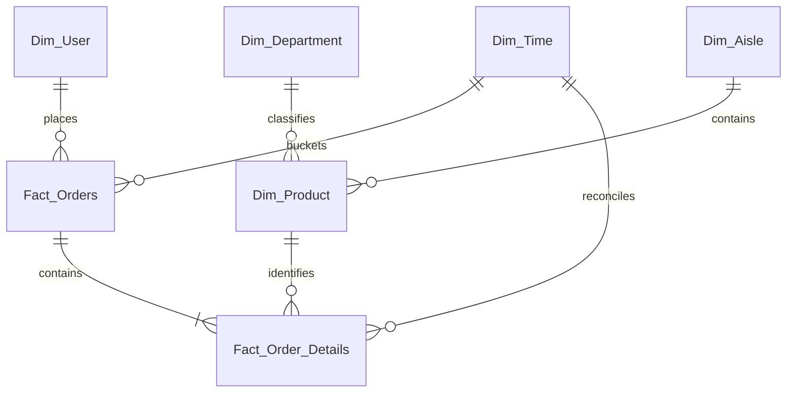

# Warehouse data dictionary

## Scope and conventions

The warehouse contains five dimensions and two facts. SQL identifiers preserve
the existing `Dim_*` and `Fact_*` names. Source identifiers are retained as
business keys where available.

`time_id` is encoded as `order_dow * 100 + order_hour`. It identifies one of
168 recurring day/hour combinations; it is not a date, timestamp, or monotonically
increasing event key.

## Logical relationships

Only the links from `Dim_Product` to `Dim_Aisle` and `Dim_Department` are
physical foreign keys in the DDL. Relationships touching partitioned fact tables
are logical contracts enforced by ETL reconciliation and warehouse checks.

## Table summary

| Table | Grain | Primary or business key | Partitioning |
| --- | --- | --- | --- |
| `Dim_Time` | One recurring day-of-week and hour combination | `time_id` | None |
| `Dim_Department` | One source department | `department_id`; unique `department_name` | None |
| `Dim_Aisle` | One source aisle | `aisle_id`; unique `aisle_name` | None |
| `Dim_Product` | One source product | `product_id` | None |
| `Dim_User` | One user derived from loaded orders | `user_id` | None |
| `Fact_Orders` | One loaded prior/train order | Composite PK (`order_id`, `order_dow`); `order_id` uniqueness is an ETL contract | LIST by `order_dow` |
| `Fact_Order_Details` | One product occurrence in one order | Composite PK (`detail_id`, `order_id`); unique (`order_id`, `product_id`) | RANGE by `order_id` |

## `Dim_Time`

Prepopulated by schema creation with all seven day values crossed with all 24
hours.

| Column | SQL type | NULL | Meaning and invariant |
| --- | --- | --- | --- |
| `time_id` | `INT` | No | Primary key, calculated as `order_dow * 100 + order_hour` |
| `order_dow` | `TINYINT` | No | Source day number in `[0, 6]`, where 0 is Sunday |
| `dow_name` | `VARCHAR(10)` | No | English weekday label |
| `order_hour` | `TINYINT` | No | Source hour in `[0, 23]` |
| `hour_range` | `VARCHAR(20)` | No | Derived six-hour label: night, morning, afternoon, or evening |
| `is_weekend` | `BOOLEAN` | No | True for Sunday or Saturday |

Indexes: primary key, `idx_dow`, `idx_hour`, and `idx_weekend`. Check constraints
enforce the day and hour ranges.

## `Dim_Department`

| Column | SQL type | NULL | Meaning and invariant |
| --- | --- | --- | --- |
| `department_id` | `INT` | No | Source department identifier and primary key; positive integer |
| `department_name` | `VARCHAR(50)` | No | Non-blank source name; unique |
| `dept_category` | `VARCHAR(20)` | No | Keyword-derived `Food`, `Beverage`, `Personal Care`, `Household`, or fallback `General` |

Indexes: primary key, unique `uk_dept_name`, and `idx_category`.

## `Dim_Aisle`

| Column | SQL type | NULL | Meaning and invariant |
| --- | --- | --- | --- |
| `aisle_id` | `INT` | No | Source aisle identifier and primary key; positive integer |
| `aisle_name` | `VARCHAR(100)` | No | Non-blank source name; unique |
| `aisle_type` | `VARCHAR(30)` | No | Keyword-derived `Fresh`, `Frozen`, `Beverage`, `Snacks`, `Dairy`, `Dry Goods`, or fallback `General` |

Indexes: primary key, unique `uk_aisle_name`, and `idx_aisle_type`.

## `Dim_Product`

| Column | SQL type | NULL | Meaning and invariant |
| --- | --- | --- | --- |
| `product_id` | `INT` | No | Source product identifier and primary key; positive integer |
| `product_name` | `VARCHAR(255)` | No | Non-blank source product name |
| `aisle_id` | `INT` | No | Physical FK to `Dim_Aisle.aisle_id` |
| `department_id` | `INT` | No | Physical FK to `Dim_Department.department_id` |
| `product_category` | `VARCHAR(50)` | Yes | Currently set to `General` by ETL; DDL default is also `General` |

The two foreign keys restrict deletes and cascade key updates. Indexes cover
`aisle_id`, `department_id`, and the first 50 characters of `product_name`.

## `Dim_User`

This dimension is generated after order and order-detail reconciliation; it is
not loaded from a user CSV.

| Column | SQL type | NULL | Meaning and invariant |
| --- | --- | --- | --- |
| `user_id` | `INT` | No | Source user identifier and primary key |
| `user_segment` | `VARCHAR(20)` | No | Rule-based order-frequency segment |
| `first_order_dow` | `TINYINT` | Yes | `order_dow` for `order_number = 1`; constrained to `[0, 6]` when present |
| `avg_basket_size` | `DECIMAL(6,2)` | Yes | Mean derived `Fact_Orders.total_items`; DDL default is 0 |
| `total_orders` | `INT` | Yes | Count of loaded orders; post-load contract requires a positive value |
| `total_products_purchased` | `INT` | Yes | Sum of line-item counts across orders, not distinct product count |
| `avg_days_between_orders` | `DECIMAL(6,2)` | Yes | Mean non-NULL interval between consecutive orders |
| `last_order_date_id` | `INT` | Yes | Legacy name: stores the `time_id` of the highest `order_number`, not a calendar date |

Segment rules are deterministic:

| Segment | Loaded order count |
| --- | --- |
| `New` | fewer than 10 |
| `Regular` | 10 through 19 |
| `Frequent` | 20 through 49 |
| `VIP` | 50 or more |

Indexes: primary key, `idx_segment`, `idx_total_orders`, and
`idx_basket_size`. Check constraints reject negative order and line-item totals.

## `Fact_Orders`

Only `prior` and `train` rows from `orders.csv` are loaded. Source `test` orders
are validated but excluded because they have no matching order-product input in
this pipeline.

| Column | SQL type | NULL | Meaning and invariant |
| --- | --- | --- | --- |
| `order_id` | `INT` | No | Source order identifier; logically unique across all partitions |
| `user_id` | `INT` | No | Logical reference to `Dim_User.user_id` |
| `time_id` | `INT` | No | Logical reference to the recurring `Dim_Time.time_id` bucket |
| `order_number` | `INT` | No | Positive sequence number for the user |
| `days_since_prior_order` | `DECIMAL(6,2)` | Yes | Must be `NULL` exactly when `order_number = 1`; otherwise source range is 0 through 30 |
| `total_items` | `INT` | No | Initialized to 0, then derived as the number of order-detail rows; final contract requires greater than 0 |
| `reorder_ratio` | `DECIMAL(5,4)` | No | Initialized to 0, then derived as `AVG(reordered)` in `[0, 1]` |
| `order_dow` | `TINYINT` | No | Denormalized day number in `[0, 6]` and LIST partition key |

The primary key is (`order_id`, `order_dow`) because MariaDB requires the
partition key in every unique key. ETL separately rejects duplicate `order_id`
values across partitions.

Partitions are `p_sunday`, `p_monday`, `p_tuesday`, `p_wednesday`,
`p_thursday`, `p_friday`, and `p_saturday`. Base indexes cover `user_id`,
`time_id`, `order_number`, and `days_since_prior_order`; the additional schema
adds `idx_order_user_time` on (`user_id`, `time_id`).

## `Fact_Order_Details`

The two inputs are `order_products__prior.csv` and
`order_products__train.csv`.

| Column | SQL type | NULL | Meaning and invariant |
| --- | --- | --- | --- |
| `detail_id` | `BIGINT AUTO_INCREMENT` | No | Surrogate component of the partition-compatible primary key |
| `order_id` | `INT` | No | Logical reference to `Fact_Orders.order_id` and RANGE partition key |
| `product_id` | `INT` | No | Logical reference to `Dim_Product.product_id` |
| `time_id` | `INT` | Yes during load | Starts `NULL`, then must equal the parent order's `time_id` before ETL succeeds |
| `add_to_cart_order` | `SMALLINT` | No | Positive within-basket sequence; source contract caps it at 32,767 |
| `reordered` | `BOOLEAN` | No | Source indicator restricted to 0 or 1 |
| `quantity` | `INT` | No | Always 1 because one source row represents one product occurrence |

The primary key is (`detail_id`, `order_id`). `uk_order_product` enforces one
occurrence of a product per order in the warehouse. Source validation also
requires (`order_id`, `add_to_cart_order`) to be unique, although that pair is
not declared as a warehouse unique key.

Range partitions:

| Partition | `order_id` range |
| --- | --- |
| `p0` | less than 500,000 |
| `p1` | 500,000 through 999,999 |
| `p2` | 1,000,000 through 1,499,999 |
| `p3` | 1,500,000 through 1,999,999 |
| `p4` | 2,000,000 through 2,499,999 |
| `p5` | 2,500,000 through 2,999,999 |
| `p6` | 3,000,000 through 3,499,999 |
| `p_max` | 3,500,000 and above |

Base indexes cover order, product, time, and reorder status. Additional composite
indexes are declared for (`time_id`, `product_id`), (`product_id`, `reordered`),
(`order_id`, `product_id`, `reordered`), and
(`product_id`, `time_id`, `reordered`). These declarations document supported
query shapes; no performance improvement is asserted without a benchmark.

## NULL semantics and derived-state lifecycle

`NULL` is not interchangeable with zero in this model.

- `Fact_Orders.days_since_prior_order = NULL` means no prior order exists. A
  zero means a valid zero-day interval.
- `Fact_Order_Details.time_id = NULL` is permitted only as transient load state.
  Reconciliation fills it from `Fact_Orders`, and final checks require zero
  unresolved values.
- `Dim_User.avg_days_between_orders` may be `NULL` for a user with no non-NULL
  repeat interval; SQL `AVG` ignores the first-order NULL.
- `Dim_User.first_order_dow` and `last_order_date_id` are nullable in DDL. The
  normal ETL derives both from valid order sequences, but no DDL foreign key is
  attached to either value.
- Several `Dim_User` columns have zero defaults but are nullable at the DDL
  level. Post-load checks, rather than defaults, define whether derived state is
  usable.
- `Dim_Product.product_category` is nullable in DDL, while the current transform
  always emits `General`.

## Source contracts

The ETL requires these files under `DATA_PATH`:

| Setting key | File | Required grain checks |
| --- | --- | --- |
| `departments` | `departments.csv` | Unique positive `department_id`; unique non-blank name |
| `aisles` | `aisles.csv` | Unique positive `aisle_id`; unique non-blank name |
| `products` | `products.csv` | Unique positive `product_id`; positive aisle and department identifiers; non-blank name |
| `orders` | `orders.csv` | Unique positive `order_id`; positive user/order number; day 0-6; hour 0-23; valid first-order NULL rule |
| `order_products_prior` | `order_products__prior.csv` | Unique order-product and order-position grains; positive identifiers and position; reorder in `{0, 1}` |
| `order_products_train` | `order_products__train.csv` | Same contracts as the prior order-product file |

Validation fails on missing columns, empty frames, non-integer identifiers,
unsupported `eval_set` values, out-of-range values, NULL required fields, blank
names, or duplicate grains. The pipeline does not silently clean invalid rows.

## Warehouse quality contracts

The Python pipeline succeeds only when all of these checks match their expected
values:

| Contract | Expected result |
| --- | --- |
| `Dim_Time` row count | 168 |
| Duplicate `Fact_Orders.order_id` groups | 0 |
| Orders with `total_items <= 0` | 0 |
| Invalid first/repeat order interval semantics | 0 |
| Detail rows with unresolved `time_id` | 0 |
| Detail rows without a matching product | 0 |
| Users with `total_orders <= 0` | 0 |

`sql/12_data_quality_checks.sql` provides a complementary SQL audit for duplicate
order-product grains, detail/order time mismatches, orphan detail orders, orphan
detail products, and interval semantics. Every returned violation count is
expected to be zero.

## Modeling tradeoffs

- Partition-compatible composite primary keys are physical storage constraints;
  business-grain uniqueness remains an explicit ETL contract.
- Fact relationships are not protected by DDL foreign keys. This avoids an
  unsupported partition/FK combination but moves correctness responsibility to
  reconciliation and validation.
- `order_dow` is intentionally duplicated in `Fact_Orders` for partitioning.
  `time_id` remains the canonical day/hour combination and consistency depends
  on the transform that derives both from the same source row.
- Customer fields are convenient batch-derived attributes, not slowly changing
  dimensions. Reloading facts requires recomputing them.
- The schema models product occurrences, not purchased quantities greater than
  one, because the source exposes one order-product row and the transform fixes
  `quantity` to 1.
- The available temporal data supports recurring weekly/hourly analysis only;
  calendar cohorts and freshness metrics would require a different source.
