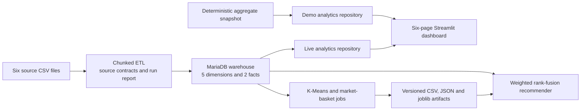

# Instacart Decision Intelligence — Portfolio Brief

> **Current status:** portfolio-ready demo, tested application code, and a verified
> containerized MariaDB fixture load. A full load and performance benchmark over all
> 33,819,106 order-item rows remains a separate evidence gate.

## Project in one sentence

Instacart Decision Intelligence is an end-to-end batch analytics project that turns the
public Instacart market-basket dataset into a partitioned MariaDB warehouse, a six-page
Streamlit decision cockpit, and reproducible customer-segmentation and recommendation
artifacts.

This is a data-engineering and analytics-system project. It is not presented as a deployed
production recommender, a real-time ecommerce application, or proof of business uplift.

## System boundary

The dashboard's source policy is explicit:

- `demo` never initializes a database engine and serves deterministic aggregate data.
- `live` checks the warehouse and fails closed when it is unavailable.
- `auto` attempts the live source, disposes an unhealthy engine, and falls back to the
  labeled demo snapshot with a sanitized reason.

The demo snapshot represents 3,346,083 orders, 33,819,106 order items, 206,209 users, and
49,688 products. Those values are a deterministic presentation contract; they are not a
claim that this checkout completed a fresh full-scale ETL run.

## What was engineered

### Warehouse and ETL

- A constellation-style MariaDB model with five dimensions and two fact tables.
- Seven `Fact_Orders` LIST partitions by day of week and eight
  `Fact_Order_Details` RANGE partitions by order identifier.
- Explicit fact grains: one row per order and one row per order-product pair.
- Chunked CSV reads and batched inserts so fact loading does not require holding the full
  source corpus in memory.
- Typed, environment-driven settings with credential-safe connection summaries.
- Source contracts for required columns, nullability, ranges, integer values, uniqueness,
  and cross-file relationships.
- Duplicate-load protection: a normal run refuses to append into populated fact tables;
  clearing ETL-owned data requires both `--reset-data` and `--yes`.
- Derived order and customer metrics followed by warehouse reconciliation checks.
- A machine-readable JSON report containing a run identifier, stage timings, row counts,
  quality results, status, and sanitized failure information.

MariaDB does not support foreign keys on these partitioned fact tables, so referential
integrity for facts is deliberately enforced in the ETL and validation layers. Dimension
relationships still use database foreign keys.

### Analytics experience

- Six Streamlit workspaces: executive overview, products and aisles, shopping rhythm,
  customer segments, departments, and warehouse explorer.
- A repository abstraction keeps SQL and source selection out of page-rendering code.
- Live queries use bound parameters; dynamic table inspection is limited to a fixed
  whitelist before an identifier reaches SQL.
- Repository results are cached with a credential-free source key and can be refreshed
  without displaying connection secrets.
- Aggregate data behind charts is downloadable as CSV, providing a tabular fallback for
  the visual analysis.
- Weekend-versus-weekday comparisons normalize by days in each group, and department
  rollups preserve totals and use weighted reorder rates.

### Reproducible mining and recommendations

- K-Means uses explicit seeds, fixed `n_init`, bounded deterministic silhouette sampling,
  Davies-Bouldin score, inertia, and saved scaler/model artifacts.
- Market-basket mining supports FP-Growth or Apriori, defaults to a deterministic bounded
  order sample, retains every sampled basket in the support denominator, and uses a sparse
  basket matrix over a configurable top-product universe.
- Itemsets are serialized as JSON arrays inside CSV cells. Product names containing commas
  therefore remain exact instead of being corrupted by delimiter-based parsing.
- Rule matching requires the complete antecedent to be an exact subset of the cart and
  excludes products already present in the cart.
- Rule and cluster rankings are combined with weighted reciprocal-rank fusion rather than
  pretending their raw scores are directly calibrated.
- Mining metadata records parameters, seed, input size, metrics, elapsed time, artifact
  schema version, and produced filenames.

### Local operability

- A cache-friendly Python image runs the application as a non-root user and installs
  dependencies during the image build rather than at startup.
- Compose profiles separate the no-database demo, live MariaDB dashboard, and ETL tool.
- Health checks cover both MariaDB schema readiness and Streamlit readiness.
- A named MariaDB volume survives normal `make down` operations.
- An isolated `make smoke-fixture` workflow reapplies the SQL, loads six controlled CSVs
  through the packaged ETL, executes quality gates, and reconciles all seven table counts.
- `Makefile` targets provide the intended demo, schema, ETL, live, validation, log, and
  teardown workflows.

## Copy-ready CV entry

**Instacart Decision Intelligence** — Python, Pandas, SQLAlchemy, MariaDB, Streamlit,
Plotly, scikit-learn, mlxtend, Docker, GitHub Actions

- Designed a MariaDB analytical model for the Instacart corpus with five dimensions, two
  explicit fact grains, seven day partitions, eight order-range partitions, and analytical
  indexes.
- Refactored ETL into chunked, contract-validated stages with duplicate-load protection,
  derived-metric reconciliation, post-load quality gates, and machine-readable execution
  reports.
- Built a six-page Streamlit decision cockpit with deterministic demo, fail-closed live,
  and health-checked auto-fallback modes behind a parameterized repository layer.
- Implemented reproducible K-Means segmentation, sparse FP-Growth/Apriori analysis,
  exact-JSON association rules, and a weighted reciprocal-rank-fusion recommender.
- Added 104 offline unit, contract, and application-smoke tests plus an isolated MariaDB
  fixture workflow; configured CI for Python 3.11 and 3.13 with Ruff and targeted coverage
  gates.

The final bullet means the local suites, fixture integration, and CI policy exist. It does
not imply that a remote CI run or full-dataset benchmark was verified by this document.

## Verified engineering evidence

The following checks were run locally on **2026-08-09** against this branch:

| Check | Command | Observed result |
| --- | --- | --- |
| Offline test suite | `make qa` | `104 passed in 3.53s`; Ruff passed; no mining `FutureWarning` |
| ETL coverage gate | Targeted ETL pytest command from CI | 51 tests passed; 97.52% coverage |
| Dashboard coverage gate | Targeted dashboard pytest command from CI | 28 tests passed; 82.73% coverage; all six pages navigated |
| MariaDB fixture integration | `make smoke-fixture` | Idempotent schema and packaged ETL passed; exact counts reconciled across seven tables |
| Demo container health | `make demo-detached` plus health endpoint | Streamlit returned `ok`; application process ran as UID `10001` |
| Runtime configuration | `make validate` | Shell syntax and all Compose profiles passed validation |
| Static lint | `ruff check etl dashboard mining tests` | `All checks passed!` |

The 104 cases cover:

- settings validation, safe database URLs, source contracts, transformations, ETL
  orchestration, destructive-action guards, failure reports, and warehouse check handling;
- deterministic aggregate reconciliation, repository limits and whitelists, parameterized
  live-query behavior, source fallback, sanitized failures, and smoke navigation through
  all six dashboard pages;
- artifact JSON validation, deterministic and bounded clustering, sparse basket encoding,
  exact itemset serialization, complete-antecedent matching, cart exclusion, item-space
  consistency, weighted rank fusion, and mining CLI contracts.

The 104-test default suite is intentionally offline and deterministic. The separate fixture
workflow proves schema application, real MariaDB writes, derived metrics, and post-load
quality checks without pretending that a tiny fixture is a scale benchmark. GitHub Actions
is configured to run on Python 3.11 and 3.13, enforce 90% coverage over the targeted ETL
modules, enforce 80% coverage over the targeted dashboard modules, and treat mining
`FutureWarning` messages as errors. This document does not claim a current remote Actions
result.

## Decisions and tradeoffs

| Decision | Why it fits this project | Cost or limitation |
| --- | --- | --- |
| Batch warehouse instead of streaming | The public source is a historical CSV snapshot with no event feed. | No real-time inventory or recommendation freshness claim. |
| Partition facts by day and order range | Matches temporal analysis and bounded order-range access while demonstrating physical design. | Partitioning adds operational complexity, constrains primary keys, and needs a measured benchmark before claiming speedups. |
| Enforce fact integrity in ETL | MariaDB partitioned tables cannot carry the desired foreign keys. | Correctness depends on load and validation gates, not only database constraints. |
| Store derived fact/user metrics | Makes dashboard queries simpler and cheaper. | Metrics must be recomputed and reconciled after every load. |
| Separate demo, live, and auto modes | Reviewers can run a useful dashboard without downloading a large dataset, while live mode stays honest. | Demo aggregates demonstrate UX and contracts, not database performance. |
| Use sparse baskets and cap the product universe | Bounds local memory use and keeps mining practical. | Long-tail products outside the configured top-N are excluded from that run. |
| Bound and seed silhouette evaluation | Makes clustering repeatable and avoids an all-pairs score over very large inputs. | A bounded sample approximates the full silhouette score. |
| Serialize itemsets as JSON arrays | Preserves exact identifiers and product names, including commas. | CSV is portable but less queryable than a dedicated feature/artifact store. |
| Fuse ranks with weighted RRF | Combines rule and cluster rankings without assuming comparable raw score scales. | Weights and `rrf_k` still require evaluation against held-out behavior or online experiments. |
| Keep the default suite offline | Produces fast, deterministic feedback in local development and CI. | Fixture integration stays in a separate Docker workflow; full-scale tests still need a benchmark environment. |

## Interview talking points

### Thirty-second overview

“I took a course-style warehouse and rebuilt it as a reproducible analytics product. The
work spans the data contract, chunked ETL, partition-aware MariaDB schema, source-safe
dashboard architecture, and deterministic mining artifacts. I also separated an honest
offline demo from live mode, then added 104 fast tests so reviewers can verify behavior
without first loading 33.8 million rows.”

### Why two facts?

`Fact_Orders` captures order-level measures and supports customer/time analysis.
`Fact_Order_Details` captures the order-product grain needed for product, department,
reorder, and basket analysis. Keeping both avoids repeatedly reconstructing order measures
from tens of millions of detail rows.

### How is a repeated ETL run kept safe?

The pipeline checks required source files and schema first, refuses a populated target by
default, and requires explicit destructive confirmation before truncating ETL-owned tables.
Each stage reports rows and duration, derived metrics run after facts, quality gates run at
the end, and both success and failure produce a JSON report.

### Why maintain a demo repository?

The raw dataset is large and distributed separately. Requiring every reviewer to download
and load it would make the portfolio difficult to evaluate. Demo mode is deterministic,
clearly labeled, and tested for internal reconciliation; live mode still fails closed, so
the interface never silently presents demo values as live warehouse results.

### What was the subtle mining correctness problem?

There were three: comma-delimited itemsets corrupt valid product names, a rule should match
only when its entire antecedent is present, and independent recommendation engines do not
produce directly comparable raw scores. JSON itemsets, exact set inclusion, one resolved
item space, cart exclusion, and weighted rank fusion address those failure modes.

### What would be productionized next?

Run the existing fixture integration workflow in remote CI, then add dataset checksums and
lineage, incremental loading or orchestration, observable job metrics, an artifact registry,
held-out recommender evaluation, authentication, and a deployment target. Those are
deliberately roadmap items, not current claims.

## Five-minute portfolio walkthrough

1. Start `make demo` and identify the visible “Representative demo snapshot” source label.
2. Show the executive overview, then explain that every chart reads through the same
   repository contract.
3. Open shopping rhythm and explain the per-day normalization used for weekend comparisons.
4. Open warehouse explorer and demonstrate the table whitelist and metadata views.
5. Show the checked-in screenshot and run `make qa`; optionally demonstrate the isolated
   `make smoke-fixture` contract.
6. Show `artifacts/etl/latest.json` or mining metadata only from a completed full-data run;
   do not substitute example numbers.
7. Finish with the evidence boundary below.

## What not to claim yet

Until a recorded full live benchmark exists, do **not** claim:

- that this checkout loaded all 33,819,106 order-item rows successfully;
- a specific ETL duration, rows-per-second rate, peak memory figure, or warehouse size;
- “7× faster,” “sub-second queries,” or any other partition/index speedup;
- a specific silhouette score, Davies-Bouldin score, rule count, lift, recommendation
  precision, conversion rate, or revenue impact;
- production deployment, high availability, real-time processing, security certification,
  or production-scale reliability;
- current remote CI success solely from the local test result.

The schema and code are designed for the published corpus, and the demo snapshot reconciles
to its representative totals. Those facts are different from executing and measuring a new
full live run.

## Full-scale benchmark acceptance gate

A defensible 33.8M-row claim should be accompanied by one checked-in benchmark report that
records:

1. Git commit, dataset source/version, and SHA-256 checksums for all six input CSV files.
2. CPU, memory, storage, operating system, Docker, Python, and MariaDB versions.
3. A clean schema/load procedure and the generated `artifacts/etl/latest.json` report.
4. Source counts, warehouse table counts, all Python quality results, and the expanded SQL
   data-quality checks.
5. Wall time per ETL stage, total wall time, peak memory, disk footprint, and calculated
   throughput.
6. Cold and warm query timings over repeated trials, with distributions rather than one
   best run.
7. `EXPLAIN PARTITIONS` evidence for partitioned and comparison queries before stating a
   speedup.
8. Full clustering and explicit `instacart-basket --full` metadata, including parameters,
   metrics, runtime, memory, and artifact hashes.
9. A clear PASS/PARTIAL/FAIL conclusion and every limitation observed during the run.

Once that evidence exists, replace cautious “designed for” language with the measured
result—never with an estimate copied from an earlier environment.
